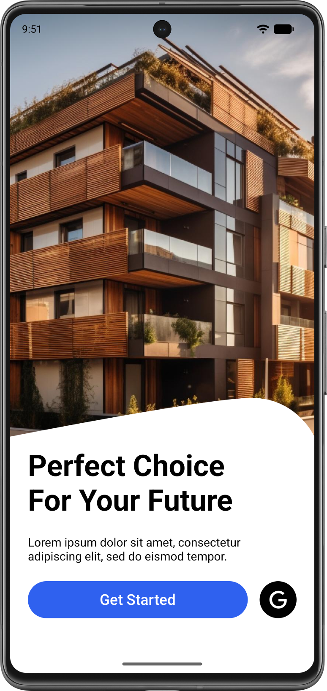
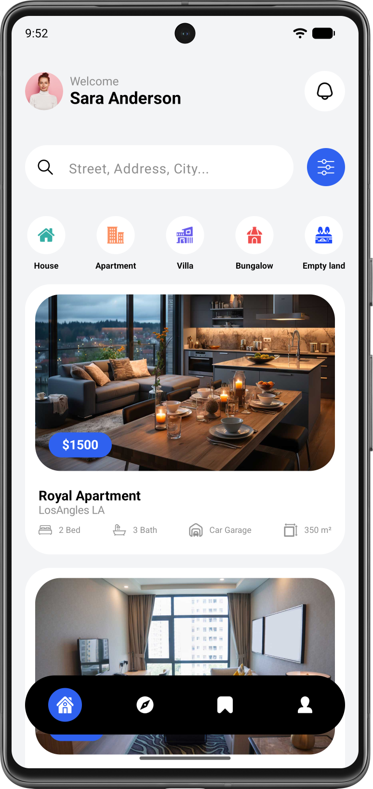
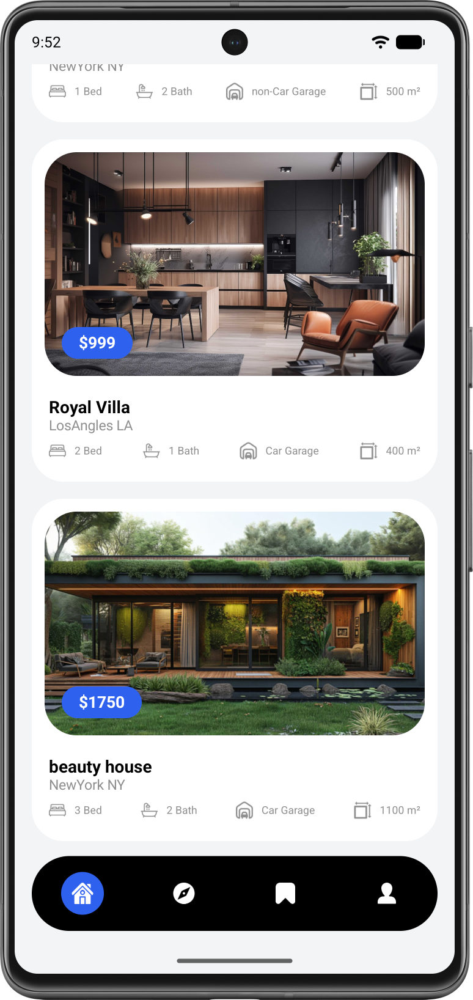
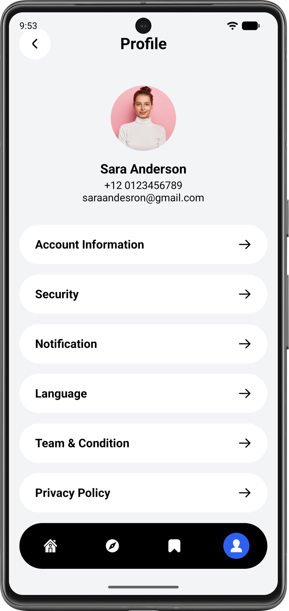

# 🏠 Real Estate – UI-прототип

Визуальный прототип приложения для поиска недвижимости. Три экрана, современный дизайн на Jetpack Compose, нижняя панель навигации и наглядные карточки объектов. Демонстрирует структуру интерфейса без реальной логики поиска и фильтрации.

---

## 🛠 Технологический стек

---

## ✨ Что внутри

- **🚀 Начальный экран** – минималистичный сплэш с лозунгом и плавным переходом к основному функционалу.
- **🏡 Главный экран недвижимости** – категории (дома, квартиры, коммерческая), строка поиска, кнопка фильтров и прокручиваемый список объектов.
- **📋 Карточка объекта** – каждая карточка показывает:
  - цену,
  - фотографию,
  - общую площадь,
  - количество спален,
  - количество ванных комнат,
  - наличие гаража (иконкой c текстом).
- **👤 Экран настроек** – имитация профиля пользователя: аватар, имя, email, краткая информация аккаунта.
- **📌 Нижняя панель навигации** – переключение между «Главной» и «Настройками» с помощью иконок.

> ⚠️ Поиск, фильтрация и обработка нажатий не реализованы – это UI‑прототип. Все данные статичны.

---

## 🎥 Демонстрация

  
   
  <em>Навигация между экранами, прокрутка списка недвижимости и отображение карточек.</em>

---

## 📸 Скриншоты

| Начальный экран | Главный экран |
| :-------------: | :-----------: |
|  |  |

| Список недвижимости | Экран настроек |
| :------------: | :--------------: |
|  |  |

---

## 🧱 Особенности реализации

- **UI полностью на Compose**, без XML. Экраны построены с использованием `Scaffold`, `LazyColumn`, `Row` и других composable-компонентов.
- **Навигация** реализована с помощью `NavHost` и нижней панели (`NavigationBar`). Переход между экранами «Главная» и «Настройки» работает полноценно.
- **Данные для списка недвижимости** – захардкоженный список объектов, каждый из которых содержит цену, площадь, количество комнат, ванных, наличие гаража и ссылку на локальный ресурс изображения.
- **Категории** – контент списка не фильтруется.
- **Строка поиска** – `TextField`, значение которого нигде не используется.
- **Кнопка фильтрации** – просто иконка, без обработчика.
- **Экран настроек** – статичная верстка с иконкой профиля, именем, почтой.
- **Начальный экран** отображается при запуске, по нажатию автоматически переходит на главный экран через `navController.navigate`.

---

## 🚀 Быстрый старт

1. Перейдите в раздел [**Releases**](https://github.com/kerikir/RealEstate/releases).
2. Скачайте APK-файл (`RealEstateUI_v1.0.apk`).
3. **Установка:**
   - Откройте файл на Android-устройстве.
   - Если нужно, разрешите установку из неизвестных источников.
   - Следуйте инструкциям на экране.
4. Запустите «Real Estate» – изучайте интерфейс.

---

## ⚙️ Использование (элементы интерфейса)

| Элемент | Назначение |
|---------|------------|
| **Строка поиска** | Визуально активна, можно ввести текст, но поиск не выполняется. |
| **Кнопка фильтров** | Нажимается, но не открывает фильтры. |
| **Категории** | При нажатии список не меняется. |
| **Карточка недвижимости** | Нажмите – имитация выбора, но без перехода на детальный экран. |
| **Нижняя панель** | Переключайтесь между «Главной» и «Настройками». Работает корректно. |
| **Экран настроек** | Статичный профиль, кнопки не ведут к действиям. |

